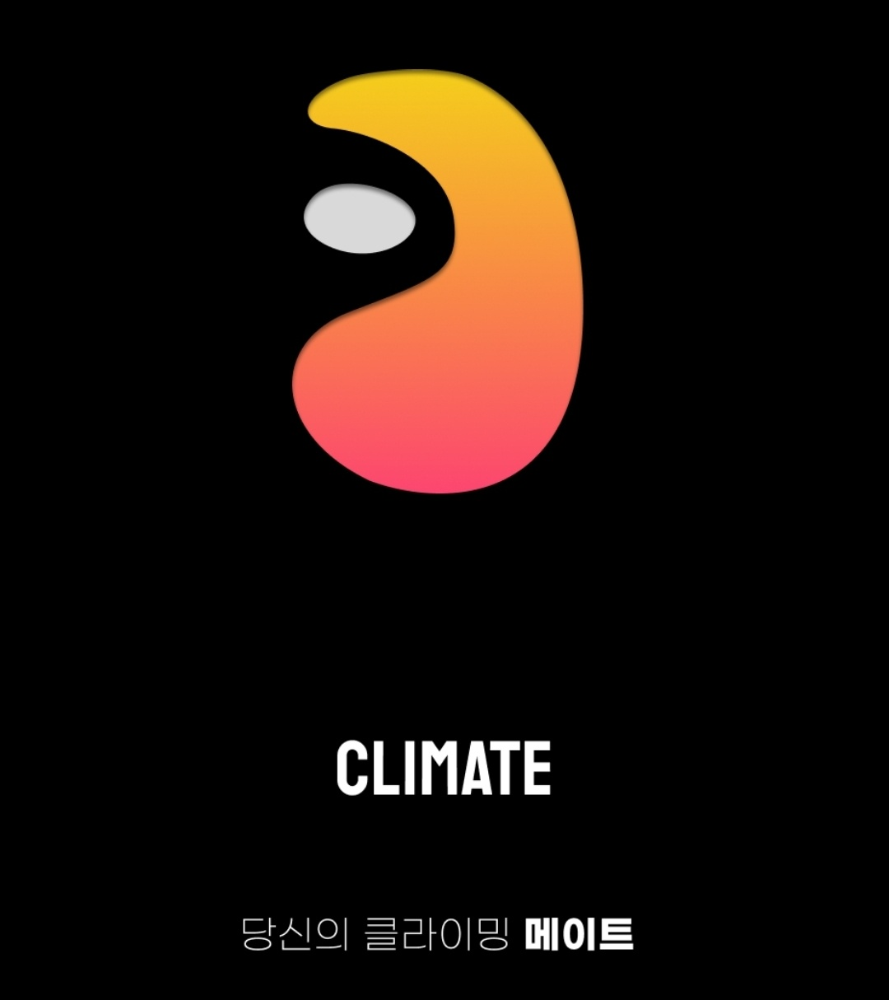
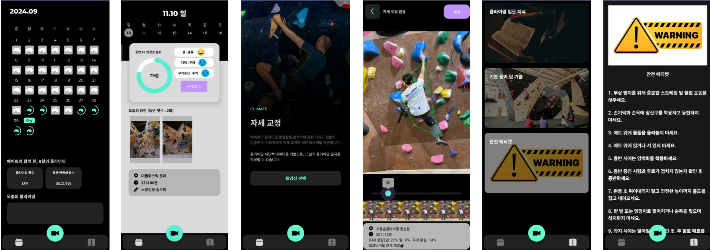

# 🚀 Climate, 당신의 클라이밍 메이트

 

## 📌 프로젝트 소개
* <i><b>Pose estimation</b></i>을 통해 추출한 사용자의 신체 데이터를 기반으로 스포츠 클라이밍 등반 자세를 분석해주고, 피드백 및 등반 기록을 관리하며, 유용한 정보를 얻을 수 있는 클라이밍 앱입니다.

 

## 💡 배경
* 최근 스포츠 클라이밍을 취미로 선택하는 인구가 증가함에 따라, 클라이밍에 입문하는 초심자들을 대상으로 <i><b>Movenet API</b></i>를 활용하여 등반 자세를 분석해주고, 유용한 정보들을 제공하여 입문자들의 진입 장벽을 낮추고 안전하게 클라이밍을 즐기게 하고자 하였습니다.

 

## 📝 주요 기능 목록

### 클라이밍 영상
* User가 자신의 등반 영상을 앨범에서 선택하여 앱에 입력

### 신체 좌표 찾기
* Movenet API를 통해 영상 속 User의 신체 4지점 좌표를 추출 

### 클라이밍 자세 평가
* User의 등반 자세에서 손-발의 위치관계, 4지점 및 무게중심 등을 기반으로 자세를 평가

### 피드백
* 영상의 타임라인 동안 평가한 피드백 데이터를 사용자에게 제공 및 저장 여부 선택

### 등반 캘린더
* 등반 영상, 피드백을 포함한 일자 별 등반 기록을 확인 가능

### 가이드북
* 입문자에게 유용한 안전 에티켓, 용어 및 기술 등의 기본 지식 제공

 

## 🛠️ 기능 요구 사항

### 1. 입출력 기능
- **사용자가 앨범에서 1분 내외의 등반 영상을 입력할 수 있다.**
  - 등반 영상은 0.2s의 time slice를 가지는 이미지 시퀀스로 변환된다.
  - 1분 미만 영상을 분석하는 시간은 30초 미만이다.
- **영상 입력 시, 4지점 및 무게중심을 시각화한 분석 영상을 제공한다.**
  - 올바른 자세일 시 초록색 실선의 4지점이 형성된다.
  - 잘못된 자세일 시 붉은색 실선의 4지점이 형성된다.
  - 무게중심은 파란색 점으로 나타난다.

### 2. 피드백 기능
- **Movenet API를 통해 사용자의 신체 데이터를 추출한다.**
  - 총 17개의 관절 데이터를 포함한다.
  - 손, 발의 위치관계인 4지점을 생성 및 시각화한다.
  - 사용자의 무게중심 좌표를 생성 및 시각화한다.
- **추출한 데이터를 통해 피드백을 생성한다.**
  - [1] 양 손의 x좌표 사이에 양 발의 x좌표가 모두 없다면 피드백을 생성한다. 
  - [2] 사용자의 4지점 외부에 무게중심이 위치할 때 피드백을 생성한다.
  - [3] 팔을 굽힌 상태를 오래 유지할 시 피드백을 생성한다.
- **저장 여부를 선택한다.**
  - Y) 등반 장소, 시간, 메모 등을 입력하여 해당 날짜의 캘린더에 피드백을 포함한 등반 기록을 저장한다.
  - N) 피드백 기능을 종료한다.

### 3. 캘린더 기능
- **캘린더의 특정 날짜를 선택하여 해당 일자의 등반 기록을 확인할 수 있다.**
  - 같은 일자에도 여러 등반 기록이 있을 수 있다.
  - 일자 선택 시, 해당하는 일자의 모든 등반 기록이 나오며 평균 안정섬 점수를 출력한다.
  - 각 등반 기록을 클릭할 시, 피드백 영상을 포함한 해당 등반 기록의 상세 정보를 확인할 수 있다.

### 4. 가이드북 기능
- **클라이밍 입문자에게 도움이 될 만 한 유용한 정보를 페이지 별로 확인할 수 있다.**
  - 1. 클라이밍 입문 지식
  - 2. 기본 용어 및 기술
  - 3. 안전 에티켓

 

## 💻 실행 화면

